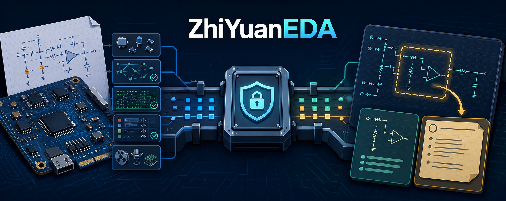
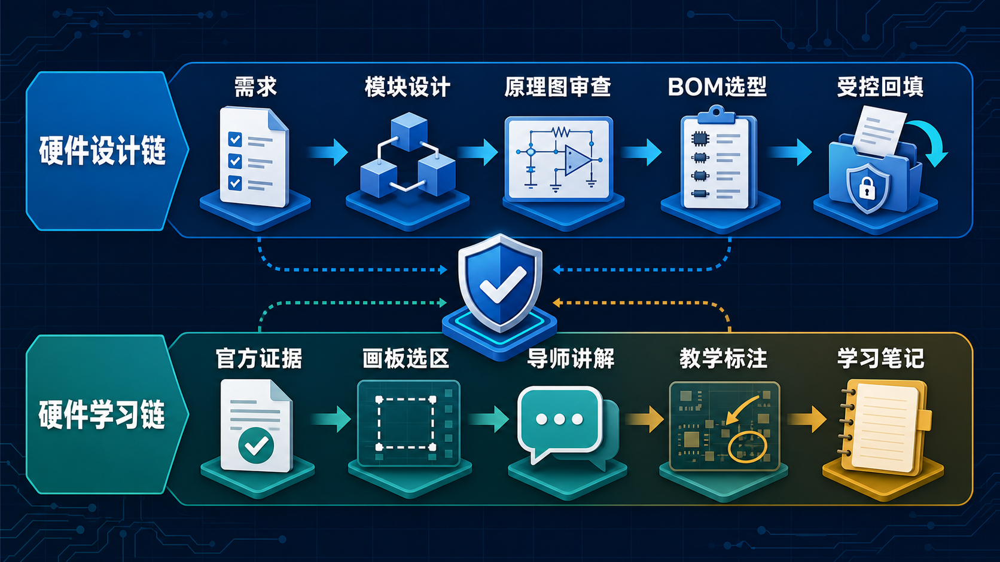

# 黑五EDA

[](https://github.com/Lyyyy212/HeiWuEDA/actions/workflows/ci.yml)


[](LICENSE)

<p align="center">
  
</p>

> 面向嘉立创EDA专业版的模块化硬件工作台，围绕“硬件设计全生命周期”和“硬件学习与知识沉淀”两条核心链路组织功能。

`黑五EDA` 由个人开发者 **Lyyyy** 独立开发。项目连接官方 EasyEDA API，
但不是嘉立创EDA官方产品，也不代表嘉立创或 EasyEDA 的认可与背书。

本仓库是面向 GitHub 的公开源码版本，不包含真实工程、现场证据、账号信息、访问凭据或
EasyEDA 项目数据。原创部分依据 [PolyForm Noncommercial 1.0.0](LICENSE) 提供，
**禁止商业使用，也不提供商业授权**。

## 第一次来？先看这里

可以把嘉立创EDA理解成真正绘制和保存电路的“设计桌”，把 黑五EDA 理解成桌旁的
“硬件协作助手”：它先确认你正在操作哪个工程、哪一张图，再帮助检查设计、整理证据、
选择器件，或者把电路放到学习画板上讲明白。

它主要解决三件事：

| 你遇到的问题 | 黑五EDA 怎么帮你 |
| --- | --- |
| **设计过程容易乱** | 把需求、模块设计、原理图审查、BOM 选型和回填拆成有产物、有门禁的步骤 |
| **API 操作怕跑错工程** | 每次连接都核对窗口、工程和文档 UUID，只允许清单中的官方方法，并保留执行证据 |
| **原理图看不懂、知识难沉淀** | 把官方证据导入学习画板，框选某段电路提问，得到带证据的讲解、标注和学习笔记 |

### 30 秒导览

1. **连接设计**：打开嘉立创EDA工程，通过官方 Bridge 接入当前窗口。
2. **确认对象**：黑五EDA 核对工程、图页和文档类型，防止对错页面操作。
3. **选择链路**：要推进项目就进入“硬件设计链”；要理解电路就进入“硬件学习链”。
4. **留下证据**：读取、审查、导出和受控写回都会生成可核对记录，而不是只返回一句结论。

| 如果你现在想…… | 从这里开始 |
| --- | --- |
| 从需求开始做一个硬件项目 | `concept`，进入硬件设计链 |
| 审查已有原理图或 PCB | `schematic_review`，采集正式证据 |
| 确定器件和采购信息 | `bom_selection`，形成有依据的最终 BOM |
| 看懂某一段原理图 | 学习画板框选后使用 `explain-selection` |
| 追踪信号、电源或比较方案 | 使用 `trace-signal`、`power-path` 或 `compare-options` |

> 关键原则：学习链只负责“看懂、解释和记录”，不会直接修改 EasyEDA；需要修改设计时，
> 结论必须重新进入设计链并通过相应门禁。

## 项目组成

黑五EDA 不是一个单独的 API 脚本，而是一组职责隔离、通过明确契约协作的模块：

| 模块 | 位置 | 主要功能 | 服务链路 |
| --- | --- | --- | --- |
| API 契约与注册表 | `easyeda_gateway/contract.py`、`api-manifest.json` | 锁定官方方法 ID、签名、枚举和风险等级；拒绝未知 API | 两条链路共享 |
| Bridge 客户端与窗口守卫 | `client.py`、`window_guard.py`、`executor.py` | 自动发现本地 Bridge、验证 `easyeda-bridge` 握手、绑定窗口/工程/文档身份 | 两条链路共享 |
| 黑五EDA Gateway 扩展 | `integrations/zhiyuaneda-gateway/` | 嘉立创EDA侧专属连接器、并行发现、重连、心跳和连接状态 | 两条链路共享 |
| 黑五EDA 工作台扩展预览 | `integrations/heiwu-workbench-extension/` | 协议 v2、专属身份与 3 项固定白名单读取操作；不替代完整 Gateway | 只读商店候选 |
| 页面与板级文档导航 | `page_navigator.py`、`board_navigator.py` | 列出页面、按 UUID 精确切换、跨页遍历并恢复原页；不保存设计 | 两条链路共享 |
| 原理图读取与证据 | `composite.py`、`exporter.py`、`formal_exporter.py`、`drc.py` | 元件/引脚/网络/拓扑读取，PNG/PDF、BOM、网表、EPRO、DRC 和证据包 | 设计链；为学习链供证 |
| PCB 分析与制造数据 | `official_plugins.py`、`ibom.py` | PCB 设计报告、18 项 DFM、制造 SVG、GenCAD 1.4、交互装配 BOM | 设计链 |
| BOM 与器件工具 | `bom.py`、`device_match.py`、`intelligence.py` | BOM 差异、器件候选评分、连接关系分析；候选结果不自动绑定器件 | 设计链；为学习链供证 |
| 导出安全与证据归档 | `export_safety.py`、`artifact_io.py`、`consistency.py`、`evidence_archive.py` | 能力矩阵、单飞熔断、不可覆盖落盘、跨产物一致性、SHA-256 归档 | 两条链路共享 |
| 生命周期编排器 | `skills/easyeda-hardware-lifecycle/` | 管理阶段、产物、门禁、失效传播和受控推进 | 设计链主控 |
| 学习编排模块 | `hwlifecycle/learning/` | 视觉导入路由、选区问题、证据请求、导师回答、会话恢复和笔记包 | 学习链主控 |
| 黑五画板插件 | `integrations/jlc-hardware-learning-plugin/` | 多画板/多图页、编号学习框、快速提问与按需深入、网表旁车、教学标注、本地导出和受控飞书笔记同步 | 学习链交互层 |
| API 材料与来源锁 | `materials/` | API 类型、JSON Schema、示例索引、固定 commit 的上游源码和许可证 | 两条链路共享 |
| 发布与质量检查 | `.github/workflows/`、`scripts/release/` | 单元测试、契约校验、插件探测、wheel 许可证检查和公开包净化 | 发布链路 |

底层 Python Gateway 的完整类与命令见
[`packages/easyeda-gateway/README.md`](packages/easyeda-gateway/README.md)。

## 两大核心链路

<p align="center">
  
</p>

两条链路共享受控 API、身份守卫和证据层：设计链产出的正式证据可以进入学习链；
学习链形成的理解和建议不会反向自动写入设计。

### 链路一：硬件设计全生命周期

这条链路把硬件开发拆成五个可追踪阶段。每一阶段都必须提交结构化产物并通过门禁，
不能仅凭对话中的一句“完成了”直接进入下一阶段。

| 阶段 | 主要功能 | 核心产物与门禁 |
| --- | --- | --- |
| `concept` | 梳理需求、优先级、系统分区、电源域、接口、方案备选和验证策略 | 需求必须可测量、有负责人；架构和验证覆盖完整 |
| `module_design` | 为每个模块定义用途、输入输出、电气约束、接口、计算、实现选项和验证计划 | 模块与接口必须互相引用一致，约束必须显式 |
| `schematic_review` | 绑定当前工程/图页，采集原理图、BOM、网表、PDF/EPRO、DRC，分析连接和风险 | 报告必须绑定当前快照；P0/P1 问题关闭后才能放行 |
| `bom_selection` | 核对 MPN、封装、规格、生命周期、库存、价格和替代料，形成最终 BOM | 不允许歧义/未匹配项；关键器件要有替代料；最终 BOM 固化摘要 |
| `bom_writeback` | 冻结 BOM、生成计划、做可恢复验收、刷新计划、授权保存、写后回读 | 只写四个采购字段；必须验证受保护字段、连接关系和 DRC 未受损 |

设计链的主要能力还包括：

- 原理图页和板级文档按 UUID 导航，跨页采集后恢复原页面。
- 原理图元件、引脚、网络、连接拓扑和分组 BOM 分析。
- whole-schematic PNG/PDF、BOM CSV、JLCEDA 网表、EPRO 与严格 DRC 证据包。
- PCB 元件/焊盘/过孔/走线统计、网络长度和规则组摘要。
- 固定源码版本的 18 项 PCB DFM、分层制造 SVG、GenCAD 1.4 与装配 BOM。
- 器件标准化 dry-run：只输出候选和评分，不绑定、不修改、不保存。
- 上游需求、接口、封装或选型变化时，自动使受影响阶段及下游结论失效。

设计链的数据流：

```text
需求与约束
  -> 系统架构
  -> 模块接口与计算
  -> UUID 绑定的原理图/PCB 证据
  -> 审查结论与整改门禁
  -> 可采购的最终 BOM
  -> 显式授权的四字段回填
  -> 保存后回读与一致性确认
```

### 链路二：硬件学习与知识沉淀

这条链路把 EasyEDA 中的设计转成可框选、可提问、可解释、可恢复的学习材料。
画板负责表达“我在问哪里”，生命周期层负责取得证据和组织回答，两者不会绕过 Gateway。

| 环节 | 主要功能 | 输出 |
| --- | --- | --- |
| 官方证据导入 | 从已封存的官方 PDF 渲染高清逐页 PNG；也支持显式选择原生 PNG 路线，并为图页绑定一次性官方网表旁车 | 带工程/文档身份、主题和 SHA-256 的页面素材与页级网表 |
| 画板组织 | 多画板/多图页管理、底图锁定、编号学习框、多选、安全缩放、小地图、矩形、箭头、自由笔、文字和便签 | 本地画板状态、选区、图页和视图状态 |
| 选区提问 | 支持框号、模块标签和组合编号引用；快速模式只携带有界上下文，需要时再深入读取证据 | `LearningQuestion` / `SelectionEnvelope` |
| 证据补充 | 按问题读取图元、网络、器件属性、BOM 或数据手册证据 | 归一化 `LearningContext` |
| 硬件导师 | 解释电源路径、信号链、器件用途、连接拓扑、BOM 选择和设计风险 | 区分证据、推断、未知项和安全提示的 `TutorAnswer` |
| 教学标注 | 把简短结论写成普通文本、矩形、高亮或箭头 | 幂等画板标注，不修改 EasyEDA |
| 知识沉淀 | 保存问题、回答、会话和画板；导出 PNG/SVG/JSON；项目主页复用一张工程总画板，每个真实原理图页复用一张学习画板，写前确认、写后回读 | 可恢复会话和受控同步的学习笔记 |

学习链当前支持六类问题路由：

- `explain-selection`：框选电路在做什么。
- `trace-signal`：信号从哪里来、到哪里去。
- `explain-component`：芯片、阻容和外围器件为什么这样选择。
- `power-path`：电源如何变换、分配和去耦。
- `review-concept`：当前设计思路可能存在哪些风险。
- `compare-options`：两种器件或电路方案的差异与取舍。

学习链的数据流：

```text
官方 EasyEDA 证据
  -> 本地高清页面素材
  -> 画板选区与自然语言问题
  -> UUID 绑定的补充证据
  -> 硬件导师解释
  -> 文本/矩形/高亮/箭头标注
  -> 会话恢复、PNG/SVG/JSON 和受控飞书学习笔记
```

### 无敏实践教程

想实际走一遍“证据导入、学习框提问、解释与飞书沉淀”的路径，可阅读
[《从证据到笔记：硬件学习画板实践教程》](docs/tutorials/hardware-learning-workflow.md)。
该教程使用公开的概念图，不包含真实工程、页面标识、导出设计或现场证据。

学习模式明确禁用图片生成、按标注改图、遥测、隐式切页、跨页证据混合和 EasyEDA 持久写入。
学习结论如果要变成设计修改，必须重新进入设计链，形成正式产物并通过对应门禁。

## 两条链路如何协同

| 共享能力 | 设计链中的作用 | 学习链中的作用 |
| --- | --- | --- |
| API Registry | 约束审查、导出和写回所需的官方方法 | 约束学习证据读取方法 |
| 身份守卫 | 防止对错误工程、页面或 PCB 操作 | 防止图片、选区和讲解上下文错页 |
| 页面导航 | 多图页审查和跨页证据采集 | 为指定页面准备官方证据；不隐式切页 |
| 证据封存 | 支撑审查、BOM、DRC 和发布门禁 | 支撑可追溯的硬件讲解 |
| BOM/网表/拓扑 | 支撑设计判断和器件决策 | 支撑器件解释、信号追踪和方案比较 |
| 生命周期状态 | 决定当前可推进的设计阶段 | 保存学习会话与设计上下文的关联 |

## 快速开始

### 安装 Gateway

仓库包含固定 commit 的上游 Git submodule，请递归克隆：

```bash
git clone --recursive https://github.com/Lyyyy212/HeiWuEDA.git
cd HeiWuEDA
python -m pip install ./packages/easyeda-gateway
python -m easyeda_gateway --version
```

环境要求：Python 3.11+、Node.js 18+、嘉立创EDA专业版，以及本仓库的
黑五EDA Gateway 开发预览包或官方
[Run API Gateway](https://jlc-ext.com/item/oshwhub/run-api-gateway) 扩展。

### 连接并确认身份

```bash
python skills/easyeda-hardware-lifecycle/scripts/easyeda_gateway.py start-bridge
python skills/easyeda-hardware-lifecycle/scripts/easyeda_gateway.py discover
python skills/easyeda-hardware-lifecycle/scripts/easyeda_gateway.py windows
python skills/easyeda-hardware-lifecycle/scripts/easyeda_gateway.py export-capabilities
```

`discover` 会扫描 `49620-49629` 并验证服务标识为 `easyeda-bridge`；`windows` 返回后续操作
需要绑定的窗口、工程 UUID 和当前文档 UUID。

### 构建专属 黑五EDA Gateway

```bash
cd integrations/zhiyuaneda-gateway
npm ci
npm run quality
```

开发预览包输出到 `build/dist/zhiyuaneda-gateway_v0.1.0.eext`。当前版本用于本地联调，
仍保留官方 Bridge 的兼容执行协议，不应直接作为扩展广场正式提交包。

### 构建协议 v2 只读工作台候选

```bash
cd integrations/heiwu-workbench-extension
npm ci
npm run quality
```

候选包输出到 `build/dist/hardware-workbench_v0.4.6.eext`。它拒绝任意代码执行，只提供
操作目录、当前上下文和身份绑定后的原理图索引读取；正式商店上传与真实客户端验收仍为人工门禁。

### 初始化设计链

```bash
python skills/easyeda-hardware-lifecycle/scripts/workbench.py init --project <project-directory> --name demo
python skills/easyeda-hardware-lifecycle/scripts/workbench.py scaffold --project <project-directory> --stage concept
python skills/easyeda-hardware-lifecycle/scripts/workbench.py status --project <project-directory>
```

### 启动学习画板开发环境

```bash
cd integrations/jlc-hardware-learning-plugin
npm ci
npm run quality
npm run dev
```

学习插件的安装、数据目录和开发说明见
[`integrations/jlc-hardware-learning-plugin/README.md`](integrations/jlc-hardware-learning-plugin/README.md)。

## 安全边界

- 默认只读；所有实时操作都应绑定明确的工程和文档 UUID。
- 页面切换属于 `EPHEMERAL_NAVIGATION`，不保存、不关闭页面，也不修改文档内容。
- 普通业务模块不能提交任意 JavaScript，只能使用锁定的官方方法或固定模板。
- BOM 持久回填只允许 `Manufacturer`、`Manufacturer Part`、`Supplier`、`Supplier Part`。
- Bridge 超时不自动重试；EDA 内部操作可能在 HTTP 超时后仍继续执行。
- 未完成资格验证的导出组合会在调用前拒绝；EPRO 图像路线为 `DISABLED_BY_POLICY`。
- DRC 零错误、DFM 通过、导出成功或证据一致都不等于可制造性和量产批准。

发现安全问题时请遵循 [`SECURITY.md`](SECURITY.md)，不要在公开 Issue 中上传真实工程、
UUID、BOM、网表、截图、Bridge 日志、凭据或本地绝对路径。

## 上游能力移植

已受控适配的固定源码来源包括 Netlist Explorer、Export Design Report、BOM Compare、
Interactive HTML BOM、JLC PCB DFM、PCB to SVG、GenCAD、AI Device Standardization 和
EasyEDA API Skill。

每个仓库的锁定 commit、参考文件、许可证与移植边界见
[`MIGRATION_SOURCES.md`](packages/easyeda-gateway/MIGRATION_SOURCES.md)、
[`THIRD_PARTY_NOTICES.md`](THIRD_PARTY_NOTICES.md) 和
[`materials/manifests/sources.lock.json`](materials/manifests/sources.lock.json)。

## 目录结构

```text
HeiWuEDA/
├─ packages/easyeda-gateway/                  # 受控 API、导航、导出、PCB/BOM 与证据模块
├─ skills/easyeda-hardware-lifecycle/         # 设计链与学习链编排器
├─ integrations/jlc-hardware-learning-plugin/ # 学习画板、MCP 和本地存储
├─ integrations/zhiyuaneda-gateway/           # 完整兼容链路的专属 Gateway 扩展
├─ integrations/heiwu-workbench-extension/    # 协议 v2 三操作只读工作台预览
├─ materials/manifests/                       # API 清单、来源锁和集成配置
├─ materials/contracts/                       # 生命周期与学习数据契约
├─ materials/references/                      # 架构、边界和开发规格
├─ materials/sources/                         # 固定版本的上游子模块与 API 类型
├─ examples/api-plans/                        # 只读 API 计划示例
└─ scripts/release/                           # GitHub 发布与许可证检查
```

## 兼容性标识

公开展示品牌为 黑五EDA。以下既有技术标识继续保留，避免破坏安装脚本、本地证据和学习数据：

- Python 分发包：`easyeda-workbench-gateway`
- Python 模块与 CLI：`easyeda_gateway` / `easyeda-gateway`
- 本地状态目录：`.easyeda-hardware-workbench/`
- Schema 与 API 契约中的既有 `easyeda.*` 标识
- 当前 GitHub 仓库 slug 与克隆目录：`HeiWuEDA`
- 专属网关目录与 npm 包：`zhiyuaneda-gateway` / `@lyyyy/zhiyuaneda-gateway`
- 网关注册身份：`lyyyy.zhiyuaneda` / `zhiyuaneda`
- 既有菜单、存储与消息标识：`ZhiYuanEDA*` / `zhiyuaneda.*` / `zhiyuaneda-*`

## 验证与发布状态

GitHub Actions 会执行公开边界扫描、Gateway 单元测试、wheel 许可证检查、生命周期测试、
学习契约校验、插件冷安装探测和 MCP 探测。离线测试只证明代码、契约和发布包一致；真实 EasyEDA 验收
仍需连接官方 Bridge，并记录操作前后的工程与文档身份。

- 黑五EDA 项目发布：`0.9.1`。
- Python Gateway：`0.8.0`。
- 黑五EDA Gateway 扩展：`0.1.0` GitHub 开发预览。
- 黑五EDA 工作台扩展：`0.4.6` 协议 v2 只读开发预览，仅开放 3 项固定操作。
- 黑五画板插件：`0.1.8`，Widget URI 为 `ui://widget/jlc-hardware-learning/canvas-0.1.8.html`。
- GitHub 源码发布：已就绪，默认分支为 `main`。
- 嘉立创EDA扩展广场：仓库可重复构建 `0.4.6` 候选 `.eext`；正式上架仍需确认商店身份、在真实客户端导入并完成专属 Bridge 回读，CI 通过不等于已上架。

参与贡献前请阅读 [`CONTRIBUTING.md`](CONTRIBUTING.md)，版本变化见
[`CHANGELOG.md`](CHANGELOG.md)，发布步骤见 [`PUBLISHING.md`](PUBLISHING.md)。

## 许可证

Lyyyy 原创部分采用 [PolyForm Noncommercial 1.0.0](LICENSE)，禁止商业使用。
由于这一限制，本项目属于 **source-available**，而不是 OSI 定义的开源软件。

第三方子模块、运行时和硬件学习组件继续遵循各自许可证。特别注意：当前 tldraw 条款
不允许在没有相应授权的情况下用于生产环境；详见
[`LICENSE_SCOPE.md`](LICENSE_SCOPE.md) 和 [`THIRD_PARTY_NOTICES.md`](THIRD_PARTY_NOTICES.md)。
