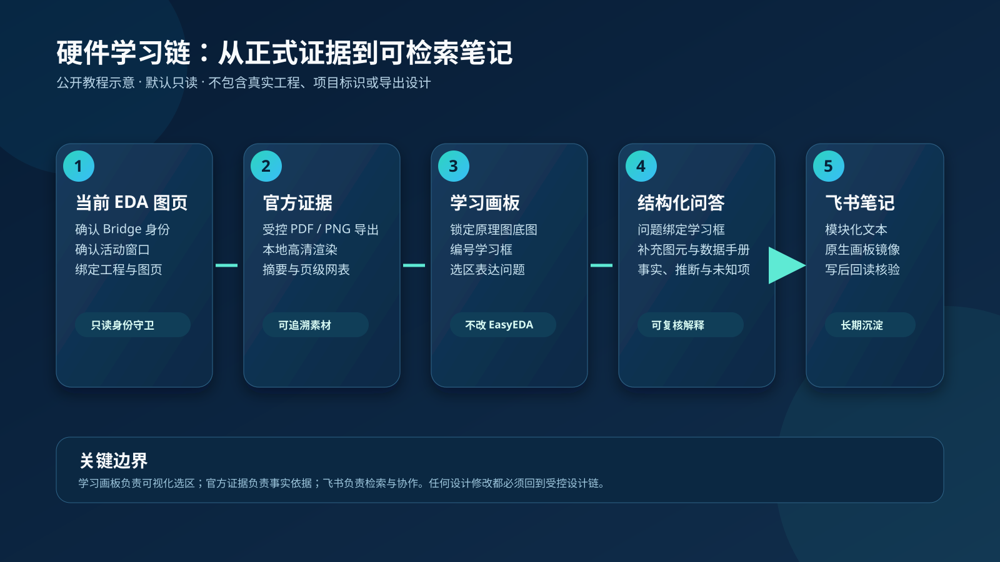

# 从证据到笔记：硬件学习画板实践教程

> 本文使用无敏的双电源学习场景说明工作流。图中的模块、框号和电源路径均为教学示意，
> 不对应任何真实工程、项目标识、元件参数或导出设计。

当你面对一张看不懂的原理图时，最有效的起点不是让模型猜图，而是先固定“当前是哪张图”，
再把可追溯的官方证据放进学习画板。这样，问题、证据、解释和笔记可以一一对应，
同时不改变原设计。

本文演示一条无敏、默认只读的学习路径：当前原理图 -> 官方导出证据 -> 学习画板选区 ->
带依据的讲解 -> 飞书学习笔记。

## 1. 先确认连接和对象

在开始前，打开目标嘉立创EDA专业版页面并连接官方 Bridge。连接成功不等于可以直接操作；
还应确认：

1. 服务身份是 `easyeda-bridge`，而不是仅有一个监听端口；
2. 有且只有预期的 EDA 窗口处于活动状态；
3. 当前工程、文档和图页的身份已经读取并绑定；
4. 学习任务只读，不调用保存、改图或 BOM 回填。

这些检查的目的，是让后续图片、选区和解释都指向同一张原理图。学习链的对象绑定和
读取边界可参照[学习画板架构](../../materials/references/learning-canvas-architecture.md)。

## 2. 使用正式证据导入画板

学习画板的底图应来自已经核验过身份的官方导出证据，而不是屏幕截图、聊天附件或
未经确认的历史文件。推荐顺序如下：

1. 对当前图页执行一次受控的官方 PDF 或 PNG 导出；
2. 在本地渲染为清晰、可缩放的页面素材；
3. 记录导出时的工程/文档/图页身份、主题和摘要；
4. 把该页面素材作为画板底图锁定；
5. 如要解释连接关系，再为同一页面绑定一次性的网表旁车。

导入行为只会生成学习材料，不会向 EasyEDA 写入任何形状、文字或修改建议。若身份或
页面不一致，应停止并重新读取，而不是沿用旧截图。

## 3. 用显式学习框表达问题范围

学习框是画板中的结构化对象，而非临时鼠标框选。每个框都应有唯一编号，并对应一个
可讲解的最小模块。下面是适用于双电源教学图的划分方式。

| 学习框 | 聚焦对象 | 适合提出的问题 |
| --- | --- | --- |
| 1 | 整流/续流二极管 | 它在两个开关状态下分别导通还是截止？额定值为何足够？ |
| 2 | 储能电感 | 如何在开关周期内储能与放能？电感值、饱和电流和 DCR 如何权衡？ |
| 3 | 开关控制器 | 控制器的输入、开关、反馈和使能引脚如何与外围相连？ |
| 4 | 功率回路与输出 | 电感、二极管、输出电容和反馈网络如何共同决定输出极性与稳定性？ |

编号应在当前图页内唯一且递增。提问时优先使用“学习框 2”这样的显式引用；如果用户
只说“这个元件”，系统必须先确认当前选区，不能根据视觉邻近关系猜测。

## 4. 从单个器件到能量路径

对电源电路，解释顺序比单独背元件功能更重要。一个实用的讲解顺序是：

1. **先看输入和目标输出。** 明确输入范围、输出极性、目标电压和负载要求。
2. **再看控制器。** 找到开关节点、反馈节点和使能路径，确认它控制哪一个功率级。
3. **沿能量路径走一遍。** 分别描述开关导通与关断时，电感、二极管和电容的电流路径。
4. **最后讨论选型。** 把电感纹波/峰值电流、二极管反向耐压与损耗、输出电容纹波、
   反馈分压和布局寄生放在同一组约束中判断。

例如，双极性电源常可拆成“输入到中间正电源轨”和“中间正电源轨到负输出”两段。
前段的电感与二极管决定能量如何送到中间轨；后段的控制器、功率回路与反馈网络决定
负输出是否稳定。该描述只是学习框架，最终拓扑、元件参数和额定值必须以当前原理图、
数据手册和实测条件为准。

## 5. 保存问题、证据和结论

每一次问答都应同时保存以下信息：

- 学习框号与画板 shape ID；
- 关联的图页和官方证据摘要；
- 用户问题与完整回答；
- 证据支持的结论、必要假设和未知项；
- 需要在设计链、仿真、DRC 或实物测试中继续验证的事项。

这样做的好处是：后续再问“为什么这样选”时，可以回到同一框、同一页和同一证据，
而不是把来自其他图页或其他版本的结论混在一起。

## 6. 同步为飞书学习笔记

飞书笔记用于长期检索和协作，JLC 学习画板仍是选区、框号和视觉标注的权威来源。推荐
在同一篇项目笔记中依次放入：

1. 本次学习的图页范围和证据来源；
2. 学习框索引及每个框的问答；
3. 电源或信号路径的总结；
4. 数据手册、应用笔记和教程链接；
5. 未确认的参数、风险和下一步验证计划；
6. 一个原生飞书画板块，用于镜像底图和编号学习框。

写入前应确认目标文档和版本；写入后必须回读文档与画板预览。不要把普通截图当作
原生画板，也不要覆盖用户在同步区以外写的自由笔记。详见
[飞书学习笔记集成设计](../../materials/references/lark-learning-note-integration.md)。

## 7. 最终检查清单

- [ ] Bridge、EDA 窗口、工程、文档和图页身份一致。
- [ ] 底图来自当前页的正式导出证据，而非未验证截图。
- [ ] 学习框编号唯一，并能映射到确定的模块。
- [ ] 解释中已分开列出事实、推断、假设和未知项。
- [ ] 没有因为学习流程修改或保存 EasyEDA 设计。
- [ ] 飞书笔记和原生画板已写后回读。
- [ ] 涉及电流、温升、耐压、稳定性和 PCB 布局的结论，仍保留仿真、DRC 或实测验证项。

## 延伸阅读

- [学习画板架构](../../materials/references/learning-canvas-architecture.md)
- [飞书学习笔记集成设计](../../materials/references/lark-learning-note-integration.md)
- [硬件学习插件说明](../../integrations/jlc-hardware-learning-plugin/README.md)
