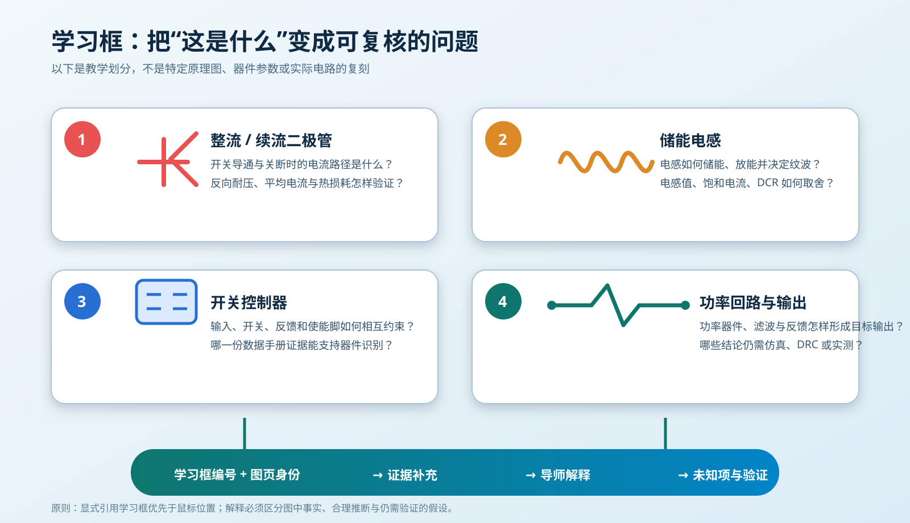
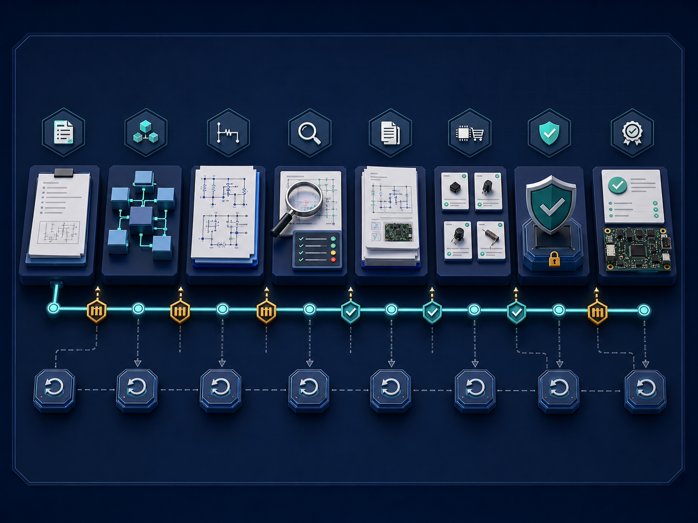

# 黑五EDA 工作台扩展（协议 v2 只读预览）

**面向学习画板与原理图流程的嘉立创EDA只读入口预览。**

黑五EDA 将“看懂一张原理图”和“完成一套可验收的原理图设计”放进同一个工程上下文。当前 `0.4.6` 是协议 v2 开发预览，只开放操作目录、当前上下文和原理图索引三项只读能力；完整学习链与设计链由仓库中的画板插件、受控连接模块和生命周期模块共同完成，本扩展不冒充这些模块的全部功能。

[查看 GitHub 项目与使用文档](https://github.com/Lyyyy212/HeiWuEDA)


左侧展示学习画板如何组织编号学习框、问题与知识卡片；右侧展示原理图从需求到最终验收的完整工程链。

## 两大核心功能

### 1. 学习画板：把原理图变成可追溯的学习材料

学习画板不是把原理图当作一张普通图片保存，而是围绕正式原理图证据建立可持续补充的学习记录。每个学习框都有稳定编号，并与对象、问题、解释和证据来源绑定；后续再次打开时，仍能从编号回到对应电路位置和已有结论。

```text
当前原理图 → 导入画板 → 建立编号学习框 → 针对选区提问
           → 结合证据解释 → 保存结论 → 形成结构化学习笔记
```

它主要解决四件事：

- **定位对象**：从整张原理图中圈定器件、功能模块或关键功率回路，避免问题脱离电路上下文。
- **逐框学习**：使用 1、2、3、4 等稳定编号组织学习对象，分别讲清器件作用、连接关系、能量路径和设计风险。
- **证据绑定**：把问题、回答、原理图位置和资料来源放在同一条记录中，让结论可以复查，而不是一次性聊天内容。
- **知识沉淀**：将电路总览、学习框索引、逐框解释和来源整理成可复用的硬件学习笔记。


*抽象工作流展示从原理图证据、编号学习框到解释与笔记的关系，不包含真实工程截图。*



*学习框围绕对象、储能、控制和功率输出组织可复核问题。*

完成一次学习后，得到的不是一张孤立截图，而是一份能回答“看哪里、问什么、依据是什么、结论如何复用”的学习档案。

### 2. 原理图全流程：把设计推进变成可审查、可回读、可验收的工程链

原理图全流程覆盖从需求形成到最终验收的连续过程。每一阶段都有明确输入、输出和放行条件；写入设计前保留计划与回滚点，写入后重新读取并验证，避免只凭界面观感宣布完成。



流程图展示阶段推进、审查门禁、回滚点和最终验收之间的关系。

| 阶段 | 主要工作 | 阶段产物 |
| --- | --- | --- |
| 需求定义 | 明确电源、接口、性能、尺寸、成本和约束 | 可核对的需求清单 |
| 模块设计 | 拆分功能模块，确定接口、供电与关键拓扑 | 模块边界和连接关系 |
| 原理图审查 | 检查器件、引脚、网络、电源、保护与可制造性 | 问题清单与审查结论 |
| BOM 选型 | 核对参数、封装、供应信息、替代关系和数据手册证据 | 可追溯的选型结果 |
| 受控更新 | 先冻结修改计划和回滚点，再执行明确范围内的更新 | 可回退、可比较的设计变更 |
| 最终验收 | 回读设计，检查网络、规则、导出物和阶段证据 | 验收记录与可交付结果 |

这条流程把“画完原理图”与“证明原理图可以交付”区分开：单元检查、原理图外观、引脚与网络语义、规则检查、BOM 证据和最终导出分别验证，任何一项都不能替代其他验收门禁。

## 为什么使用黑五EDA 只读预览

- **绑定当前设计对象**：入口直接关联当前工程和活动文档，减少选错工程、图页或对象的风险。
- **统一学习与设计上下文**：学习画板产生的编号、问题和证据可以继续服务于原理图审查与设计决策。
- **保留过程证据**：不仅展示结果，也记录问题、来源、门禁、回读和验收边界。
- **控制设计修改**：默认先读取和解释；需要修改时，先确定范围、计划与回滚点，再进行受控操作。

安装后，从嘉立创EDA顶部菜单选择 **黑五EDA → 打开黑五EDA** 进入紧凑状态页。该预览只负责协议 v2 的安全入口与三项只读操作；它不是现有完整连接链路的替代品。

## 版本与更新

候选版本沿用同一个扩展 UUID，并通过递增的语义化版本号发布。`0.4.0` 起，扩展只接受固定的只读操作目录，不再接收任意脚本；未知操作、工程不匹配或活动文档不匹配都会被拒绝。

源码仓库会自动执行检查、测试、可重复打包和身份校验，并生成带 SHA-256 的候选包。嘉立创官方扩展平台的上传、审核和发布仍由维护者人工完成；CI 产物不等同于已上架版本。客户端能否自动安装商店更新，以正式上架后的实际客户端验证为准。

## GitHub

源码、详细文档、教程与更新记录均在：

**<https://github.com/Lyyyy212/HeiWuEDA>**
